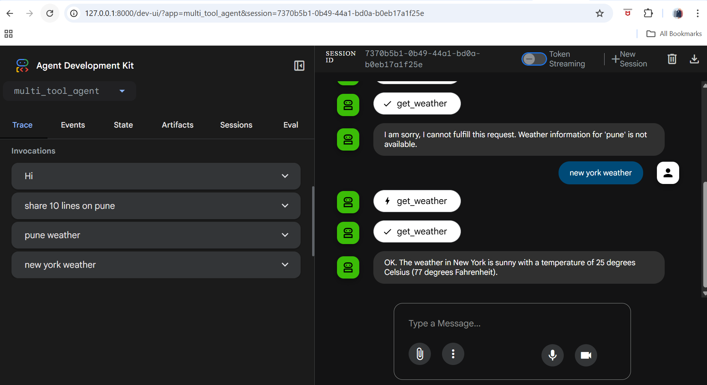

# Weather Time Agent
A simple AI agent built with Google ADK (Agent Development Kit) that provides weather information and current time for cities. Currently supports New York with demo weather data and real-time information.
Features

Weather Reports: Get current weather information for supported cities
Time Queries: Retrieve current time with timezone support
AI-Powered: Uses Gemini 2.0 Flash model for natural language interactions
Tool Integration: Seamless function calling through Google ADK


### Prerequisites

Python 3.9+
Google ADK Agents library
Required Python packages:

google-adk-agents
zoneinfo (included in Python 3.9+)

### creating a virtual Python environment using venv:

```
python -m venv .venv
```

### activate the virtual environment
```
# Windows CMD:
.venv\Scripts\activate.bat
```

### Install required dependencies
```
pip install google-adk

pip show google-adk
```

### Add llm key in .env file
```
GOOGLE_GENAI_USE_VERTEXAI=FALSE
GOOGLE_API_KEY=PASTE_YOUR_ACTUAL_API_KEY_HERE
```

### Run the following command to launch the dev UI.

```
adk web
```
### Launch application

